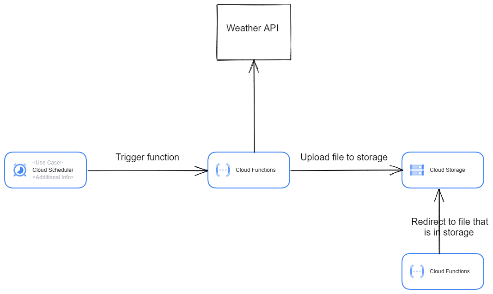

# Content
- [Description](#description)
- [Architecture](#architekture)
- [Deploying](#deploy-to-gcp)
- [How to use](#how-to-use)

# Description
Project that help monitoring the weather in Krakow using https://openweathermap.org/api.

# Architekture

- Cloud Function - fetchs data about weather using https://openweathermap.org/api, creates blob files and then uploads them to GCS bucket
- Cloud Scheduler - job to trigger this cloud function
- Cloud Storage - store blob files 

# Deploy to GCP

Deploying application to GCP:

- Set project ID - `gcloud config set project <projectID>`
- Enable all GCP APIs required by the project:
	- Cloud Run Admin API
	- Identity and Access Management (IAM) API
	- Artifact Registry API
	- Cloud Build API
	- Cloud Scheduler API
	- Cloud Functions API
- Clone github repository
- Open root folder of project - `cd GCP-project`
- Create GCP infrastracture using terraform:
	- `terraform init`
	- `terraform plan`
	- `terraform apply`

After completing all the steps above, your infrastructure will be ready to use

# How to use

After installing the infrastructure go to Navigation menu > Cloud Functions and click the weather-krakow function. Then open trigger tab and copy trigger URL. To get info about weather you sould pass additional query parameters to trigger URL: 

- `{TRIGGER_URL}?date={YYYY.MM.DD}&time={HH.MM}`
where MM in time are minutes that occur every 15 minutes and possible values are: **00, 15, 30, 45** 

**Demo url** - https://us-central1-serene-voltage-371417.cloudfunctions.net/weather-krakow?date=21.12.2022&time=15:30

